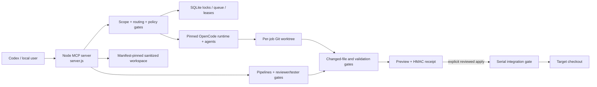
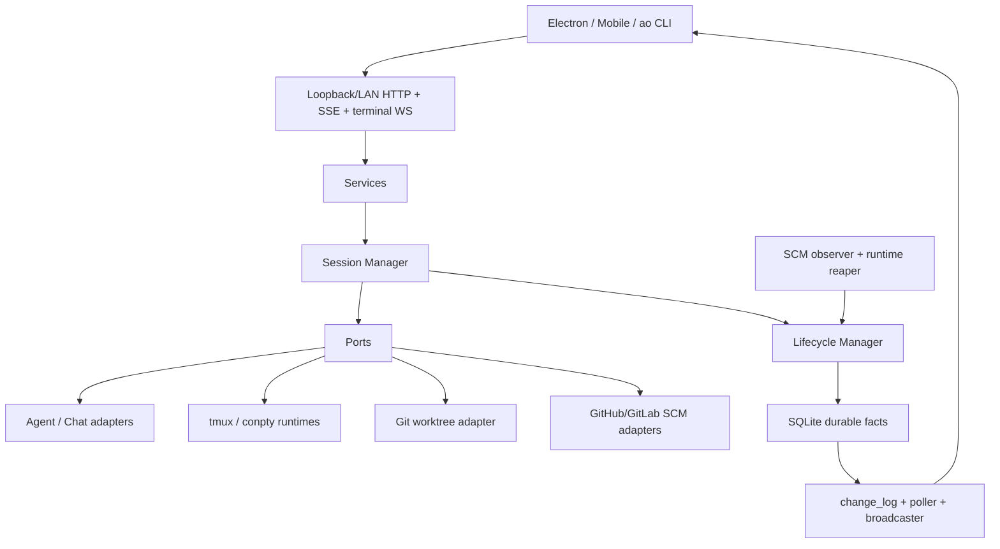
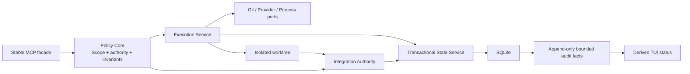

# Agent Orchestrator Protection and Architecture Feasibility Study

> تاريخ الدراسة: 2026-08-13  
> نوع الدراسة: تحليل Read-only للكود والوثائق والاختبارات؛ لا يتضمن تنفيذ migration أو refactor.  
> سياق القرار: الاستخدام الأساسي **شخصي، لمستخدم واحد وعلى جهاز محلي**؛ لذلك لا تُمنح خصائص multi-user أو enterprise مثل RBAC وmulti-tenancy وزناً إيجابياً إلا إذا عالجت تهديداً محلياً حقيقياً.  
> قرار مختصر: **Adopt selected concepts**، مع إبقاء نموذج الحماية المحلي وعدم استبداله بـ Agent Orchestrator.

## Executive Summary

النتيجة الأساسية هي أن Agent Orchestrator لا يقدم، بوصفه نظاماً كاملاً، حماية أقوى من النظام المحلي للغرض الشخصي الحالي. المشروعان يحلان مشكلتين متداخلتين لكن مختلفتين:

- النظام المحلي هو **بوابة تنفيذ وسياسة وتكامل**: يفرض Scope Contract، وأقفال كتابة، و`allowedEdits`/`forbiddenEdits`، وعزل worktree، وفحص الملفات المتغيرة، ومعاينة قبل الدمج مرتبطة بإيصال HMAC وحالة مصدر/هدف دقيقة.
- Agent Orchestrator هو **بيئة تشغيل جلسات ووكلاء محلية**: daemon طويل العمر، session/lifecycle managers، واجهات adapters، واجهة Electron، مراقبة PR/CI، controller handoff، وحالة مشتقة من facts مستديمة.

### الحكم الأمني

| الاستنتاج | الحكم | الدليل المختصر | الثقة |
|---|---|---|---|
| هل Agent Orchestrator أقوى إجمالاً؟ | لا | لا يفرض في طبقة orchestration عقد نطاق مركزي أو قائمة ملفات مسموحة مماثلة للنظام المحلي؛ بعض أوضاع العامل تعتمد على sandbox الأصلي للوكيل، و`PermissionDefault` في Codex يصل إلى bypass. | High |
| أين يتفوق Agent Orchestrator؟ | lifecycle/recovery، فصل المكوّنات، حفظ تغييرات worktree قبل التنظيف، handoff، مراقبة SCM والتغذية الراجعة مع dedup/guards. | كود workspace وsession transition وlifecycle reactions وSCM merge. | High |
| أين يتفوق النظام المحلي؟ | تقييد الكتابة، منع تجاوز النطاق، التكامل بعد مراجعة، فحص السباقات، تثبيت release/plugin/agent policy، sanitized workspace، queue/lock/provider leases. | `server.js`، self-tests وE2E/concurrency tests. | High |
| هل ميزات CI/PR/controller تعد حماية بحد ذاتها؟ | غالباً لا؛ هي usability/operations، وتصبح حماية فقط عندما تمنع انتقالاً غير صالح أو تفرض تحققاً موثوقاً. | الفصل بين observer/reaction وبين enforcement في upstream. | High |
| هل migration كاملة مبررة؟ | لا للاستخدام الشخصي الحالي. | ستضيف daemon/HTTP/Electron/terminal/adapters/config surfaces وتستبدل حدوداً محلية أقوى. | High |
| هل partial adoption مبرر؟ | نعم على مستوى concepts، لا عبر نسخ مكونات upstream كما هي. | يمكن تبني generation fencing، facts/derived status، conservative reaping، وdeduplicated nudges دون تغيير سلطة الدمج. | High |
| ماذا عن `server.js`؟ | **split gradually** مع إبقاء entry point واحد وسلوك MCP ثابتاً. | الملف 18,345 سطراً ويجمع السياسة والتنفيذ والتخزين والتكامل والاختبارات؛ التقسيم الكبير دفعة واحدة عالي المخاطر. | High |

### ما يجب ألا يتغير

تبقى هذه الحدود هي الأساس: Scope Contract الإلزامي لكل writer، worktree للكتابة، رفض المصدر المتسخ، changed-file validation، serial integration lock، preview receipt أحادي الاستعمال، إعادة فحص source/target قبل apply، reviewer/tester gates، تثبيت release/config/plugin/agent policy، وكون المستخدم هو صاحب قرار التكامل النهائي.

## Scope and Method

### النطاق

شملت الدراسة:

1. تحديد مستودع المصدر الحقيقي وتمييزه عن runtime state وgenerated worktrees.
2. قراءة `server.js`، ملفات التشغيل/البناء، README، إعدادات package، تعليمات المشروع، وملفات الاختبارات المحلية.
3. فحص كود Agent Orchestrator الفعلي عند SHA ثابت، بما فيه backend architecture وworkspace وruntime/reviewer adapters وsession/lifecycle managers وSQLite/CDC وHTTP/process وSCM.
4. مقارنة enforcement الفعلي، لا ادعاءات README وحدها.
5. تقييم ملائم للاستخدام الشخصي single-user، مع بقاء تهديدات repository/prompt injection، agent/process compromise، credential exposure، race/crash، وsame-user local process ضمن النموذج.

### طريقة تصنيف الأدلة

- **Confirmed**: مسار enforcement ظاهر في الكود أو اختبار يثبت الحالة.
- **Partial**: توجد آلية لكنها لا تغطي كل طبقات التهديد، أو تعتمد على configuration/agent sandbox.
- **Assumption**: فرض تشغيلي لم يتم التحقق منه في هذه الدراسة.
- **Potential weakness**: مسار خطر معقول يحتاج إثبات runtime أو threat-specific test قبل تسميته vulnerability.
- **Unverified**: لم يُنفذ أو لا تتوافر أدلة كافية.

مستويات الثقة:

- **High confidence**: كود مباشر مع اختبارات أو مسارات رفض واضحة.
- **Medium confidence**: كود مباشر لكن التغطية/السلوك الخارجي أو absence claim غير مكتمل.
- **Low confidence**: استنتاج يعتمد على runtime أو بيئة لم تُختبر.

### القيود

- لم تُعدّل ملفات المصدر أو الإعدادات ولم تُثبت dependencies ولم يُنشأ branch/commit.
- لم تُشغّل اختبارات upstream محلياً؛ تمت قراءة الكود والاختبارات عند commit مثبت. لذلك ادعاءات runtime الخاصة به أقل بدرجة من ادعاءات code-path.
- لم يُجر penetration test لنظام التشغيل أو حساب Windows أو مزود النموذج.
- لا يعني عدم العثور على control أنه غير موجود مطلقاً؛ absence claims محددة بالطبقات والملفات المفحوصة.

## Local Project Identity

### المستودع الصحيح

| الحقل | القيمة | الدليل | الثقة |
|---|---|---|---|
| Local repository root | `C:\Users\10User\codex-opencode-mcp` | `git rev-parse --show-toplevel` | High |
| Git remote | `https://github.com/jadAkeel/Ai_Agent.git` | `git remote -v` | High |
| Current branch | `main` | `git branch --show-current` | High |
| Current commit | `3bab0826d1379b96c8b7a31e373daf290824362f` | `git rev-parse HEAD` | High |
| Initial working tree status | clean، `main...origin/main` | `git status --short --branch` قبل إنشاء هذا التقرير | High |
| اللغة/runtime | Node.js ESM، Node `>=22.5` | `package.json` | High |
| الملف المركزي | `server.js`، 18,345 سطراً، نحو 827 KB | قياس الملف و`Get-Content` | High |

### source مقابل generated/runtime

- **Source**: جذر المستودع أعلاه، ويضم `server.js`، `bin/`، `opencode/`، `codex/`، `docs/`، `package.json` و`package-lock.json`.
- **Runtime state**: `C:\Users\10User\.codex\codex-opencode-mcp`، ويضم قواعد `projects/*.sqlite`، `provider-concurrency.sqlite*`، `queue-request.key`، و`opencode-home`.
- **Generated worktrees**: `C:\Users\10User\.codex\codex-opencode-mcp\worktrees\*`. ملفات `.git` داخلها تشير إلى المستودع الحقيقي؛ ليست source roots مستقلة.
- **Immutable active release**: `C:\Users\10User\codex-opencode-mcp-releases\server-23fa331e-20260812-final`. تجزئة `server.js` فيه تطابق المصدر وقت الدراسة: `23FA331EC829E00C3DF944EFCDB45DA4A46AEF32E322BBA2D18223C1C9E2172D`؛ تجزئة manifest الفعالة `E28794089E2D6275F4E393AA57CA7AEE950BCEB9282796650FE784FF6C34ADB0`.
- **Archived/unrelated**: لم تُعامل مجلدات releases أو attachments أو visualization workspace كمستودع المصدر.

### الحالة الفعلية المهمة أمنياً

إعداد MCP الفعال يشير إلى release مطلق ومثبت بالتجزئة، ويستخدم `WORKTREE_MODE=write`، و`QUEUE_MODE=sqlite`، و`QUEUE_WRITE_CONFLICT_POLICY=wait`، وwrite lock `simple`، وparallel write `strict`، وcleanup `never`، وexternal plugins معطلة. هذه أقوى من defaults داخل المصدر، إذ إن defaults هي worktree `off` وqueue `memory` (`server.js:124-179`). لذلك يجب الفصل بين **قدرة التصميم** و**وضع التثبيت الحالي**. الثقة: **High**.

### تعليمات المشروع

ملف التعليمات الموجود داخل المشروع هو `codex/AGENTS.md`، ويؤكد الفحص الفعلي، التغييرات الدنيا، عدم إضعاف الاختبارات، والإبلاغ عن الأوامر والمخاطر. لا يوجد `AGENTS.md` آخر عند جذر المصدر حسب البحث. الثقة: **High**.

## Current System Architecture



### المكوّنات ومسؤولياتها

| المجال | المسؤولية الحالية | دليل محلي | الثقة |
|---|---|---|---|
| MCP surface | 21 أداة للصحة، الأقفال، queue، pipelines، execution، integration، sanitized verification | `server.js:7864-9413`, `server.js:13413` | High |
| Configuration | timeouts، limits، locks، queue، worktrees، plugins، provider leases، policy pins | `server.js:124-179` | High |
| Schemas | Zod strict schemas لعقد النطاق، sanitized workspace، receipts والسياسات | `server.js:281-360` | High |
| Agent routing | direct/proxy/reject، fallback صريح فقط، مسار خاص للـ sanitized reader وorchestrator | `server.js:3005-3185` | High |
| Policy attestation | مقارنة effective agent metadata بالمصدر المُدار، permission hashes، skills/plugin trees، فحص قبل spawn | `server.js:1633-2592`, `server.js:10708-10925` | High |
| Scope/file policy | normalization، realpath/link/traversal checks، allowed/forbidden/shared/serial-only | `server.js:3187-3453`, `server.js:4690-5050` | High |
| Execution | `shell:false`، output bounds، timeouts، process-tree termination، retries المصنفة | `server.js:730-960`, `server.js:3860-4180` | High |
| Worktrees | clean source checkpoint، pinned HEAD/tree، safe global root، race recheck | `server.js:5256-5427` | High |
| Integration | contract digest، receipt، serial lock، source/target recheck، dry-run/apply/rollback | `server.js:6063-7005` | High |
| Persistence | per-project SQLite، WAL، hard locks، runs/jobs/pipelines/instances، encrypted replay request | `server.js:7077-7760`, `server.js:11770-12505` | High |
| Recovery | leases/heartbeats، stale reconciliation، queue startup resume، running jobs become interrupted لا replay أعمى | `server.js:7088-7259`, `server.js:18202-18305` | High |
| Operational UI | terminal TUI لمراقبة queue/pipeline وintegration/finalize | `bin/tui.js:33-411` | High |

## Current Protection Model

### 1. Workspace and file safety

**Confirmed controls**

- كل writer يحتاج Scope Contract صريحاً مع نطاق كتابة و`allowedEdits`; يرفض التحقق غياب العقد (`server.js:10027-10186`). **High confidence**.
- paths تمر عبر root/traversal/absolute-path وrealpath/symlink/junction checks (`server.js:3214-3297`). **High confidence**.
- `forbiddenEdits` الافتراضية تُدمج مع العقد، وتُرفض أي قائمة allowed تتداخل معها (`server.js:9990-10525`). **High confidence**.
- write worktrees تُنشأ من HEAD/tree مثبتين بعد التأكد أن المصدر خالٍ من staged/unstaged/untracked/submodule changes، ثم يعاد فحص حالة المصدر بعد الإنشاء (`server.js:5256-5427`). **High confidence**.
- بعد التنفيذ تُقارن الحالة قبل/بعد، وتُرفض read-only writes، والملفات خارج النطاق، وforbidden/shared/serial-only violations؛ rollback لا يحذف تغييراً سابقاً لا يملكه التشغيل (`server.js:4690-5050`). **High confidence**.
- التكامل لا يطبق patch بمجرد نجاح الوكيل: preview كامل غير مبتور يولّد receipt موقعاً ومحدود العمر وأحادي الاستعمال ومقيداً بهوية العقد وحالة المصدر/الهدف (`server.js:6063-6538`). **High confidence**.
- validation يراقب HEAD/index/bytes/path mutations، ويستعمل ownership-aware rollback عند الفشل (`server.js:6724-7005`). **High confidence**.

**Partial / residual risk**

- منع تعديل ملف لا يمنع بالضرورة **قراءته** إذا كان موجوداً في worktree؛ الحماية من القراءة الحساسة تحتاج sanitized workspace أو sandbox/permission أصلي موثوق. **Medium confidence**؛ مسارات changed-file هي write enforcement وليست confidentiality sandbox.
- clean-source requirement يحسن reproducibility لكنه يرفض العمل المشروع عند وجود تغييرات محلية؛ هذا trade-off usability متعمد، لا vulnerability. **High confidence**.
- cleanup `never` في التثبيت الفعلي يحافظ على الأدلة والتغييرات، لكنه يزيد البيانات المتروكة على القرص حتى تنظيف يدوي موثوق. **High confidence**.

### 2. Agent execution safety

**Confirmed controls**

- التنفيذ لا يمر عبر shell، والأوامر/args منفصلة، والمخرجات bounded، والمهل تقطع شجرة العملية (`server.js:730-960`). **High confidence**.
- fallback إلى `build` لا يحدث إلا بطلب صريح؛ sanitized/orchestrator routing لا يسقط إلى writer بديل (`server.js:3005-3185`). **High confidence**.
- read-only job يُرفض إذا انتهى routing إلى agent قابل للكتابة (`server.js:9699-9723`). **High confidence**.
- effective agent policy تُقرأ وتُقارن بالمصدر المُدار، ويعاد الفحص مباشرة قبل spawn؛ E2E concurrency يختبر metadata drift ويثبت أن process لا يبدأ (`server.js:1633-2185`, `bin/e2e-concurrency.js:789-805`). **High confidence**.
- وضع orchestrator الافتراضي planning-only. `bounded-writer` مرفوض، وcontractor يتطلب explicit user flag، capability سرية، write scope، lock، تشغيل منفرد، attestation لقائمة subagents، ومنع shell/edit في parent (`server.js:9725-9907`, `server.js:10708-10925`). **High confidence**.
- external plugins معطلة افتراضياً؛ عند السماح بها يلزم version-exact allowlist وmanifest/tree/lock/config hashes مع رفض links والتغير بعد التنفيذ (`server.js:2172-2592`). **High confidence**.

**Partial / assumptions**

- provider/model pin مثبت في configuration والـ effective metadata، لكن `actualModel` لا يعد attested إلا إذا بث OpenCode runtime event موثوقاً؛ وإلا يسجل `not_runtime_emitted` (`server.js:4148-4174`). **High confidence** كحد معلن، و**Low confidence** في النموذج الفعلي لجولة لا تبث event.
- OpenCode ومزود النموذج يبقيان داخل trusted computing base؛ bridge يقلل قدرتهما لكنه لا يثبت سلامة binary أو الخدمة السحابية خارج pins/metadata المتاحة. **Medium confidence**.
- contractor subagents تشارك aggregate contract؛ changed-file gate يحمي الناتج النهائي، لكن isolation بين subagents ليس per-writer hard-lock منفصلاً. لهذا يُمنع contractor من outer parallel job. **High confidence**.

### 3. Persistence, concurrency and recovery

- أقفال read/write/serial integration مستديمة في SQLite، مع overlap checks وTTL/heartbeats؛ cross-process E2E يغطي سباقات writers/readers/serial integration (`server.js:7318-7760`, `bin/e2e-concurrency.js:519-605`). **High confidence**.
- queue request قابل للاستئناف مشفر بـ AES-256-GCM وAAD=`jobId`; حقول prompt/task في السجلات العامة تختزل إلى hash/length (`server.js:5094-5160`, `server.js:11770-11820`). **High confidence**.
- المفتاح `queue-request.key` ذو 32 بايت وmode `0600` حيث يدعم النظام، لكنه في state directory نفسه؛ يمنع قراءة الطلب من SQLite وحدها ولا يصمد أمام process يملك حساب المستخدم/المجلد كاملاً. هذه **حدود حماية مؤكدة وليست ثغرة cryptographic** (`server.js:5094-5135`). **High confidence**.
- startup يستأنف فقط حالات قابلة للاستئناف ومشفرة مع lease/revision takeover؛ job كان `running` بلا owner صالح يصبح `interrupted` ولا يعاد بلا تمييز (`server.js:18202-18305`). **High confidence**.
- pipeline ownership/revision CAS يمنع تحديثات concurrent صامتة، والقراءة الأجنبية لا تنقل الملكية (`server.js:12275-12505`, `bin/e2e-concurrency.js:615-680`). **High confidence**.

### 4. Secrets and sensitive data

- بيئة OpenCode allowlist-based وليست inheritance كاملة؛ تمنع overrides لإعداد OpenCode وتستبعد أسماء المتغيرات الحساسة إلا opt-in صريح (`server.js:385-450`). **High confidence**.
- validation environment أيضاً محدود، ويستبعد sensitive extras (`server.js:609-630`). **High confidence**.
- logs تحذف حقول prompt/stdout/stderr/env/secrets وتقص النصوص؛ persisted values تختزل prompts وتزيل حقولاً حساسة (`server.js:633-727`). **High confidence**.
- redaction regex دفاع ثانوي فقط؛ سر بصيغة غير معروفة، أو محتوى ملف قرأه الوكيل، قد يظهر في assistant/tool output قبل أو خارج مسار log المنقّى. يلزم اختبار canary runtime وعدم وصف regex كمنع تسرب كامل. **Medium confidence**.
- sanitized workspace يثبت root وmanifest بالتجزئة، يرفض links/unsafe paths/case collisions/unexpected files، ويعيد التحقق قبل discovery وقبل wave وبعدها؛ الوكيل الخاص به يمنع edit/task/external/shell/web/skill (`server.js:2686-2810`, `server.js:10539-10925`). **High confidence**.

### 5. Governance and auditability

- الوكيل لا يمنح نفسه contractor mode: يلزم طلب مستخدم صريح وcapability غير مخزنة/معادة، مع عقد خارجي مفروض (`server.js:9751-9907`). **High confidence**.
- قرار الدمج منفصل عن التنفيذ ويحتاج preview receipt و`reviewed=true` وحالة لم تتغير؛ هذا يجعل المستخدم/المراجع صاحب القرار النهائي، لا agent process. **High confidence**.
- السجلات والـ queue/pipeline state تعطي trace جيداً، لكن لا يوجد event-sourced audit log موحد لكل transition؛ الأدلة موزعة عبر جداول ونتائج bounded. **Medium confidence**.

### 6. Multi-agent pipelines and reviewer/tester gates

- pipeline writer jobs تمر عبر lock/scope/worktree نفسها، ولا يحصل pipeline على استثناء من policy core؛ partial writer failure يحتفظ بكل worktrees للمراجعة بدلاً من دمج نجاح جزئي تلقائياً (`server.js:13413-14080`, `bin/e2e-concurrency.js:760-780`). **High confidence**.
- reviewer/tester gates يجب أن تكون managed read-only agents؛ writer agent كـ reviewer يُرفض بـ `pipeline_gate_agent_not_read_only` (`server.js:13169-13215`, self-test `server.js:15392-15415`). **High confidence**.
- write pipeline يحتاج `finalValidationCommand` على النتيجة المجمعة، ثم finalize له ownership/revision state ولا يسجل completion عند terminal fault (`server.js:13247`, `server.js:16848-17026`). **High confidence**.
- نجاح reviewer/tester هو gate إضافي وليس بديلاً عن changed-file validation أو reviewed integration receipt. **High confidence** من ترتيب pipeline/integration paths.

### الاختبارات المتاحة

- `server.js --self-test` يحتوي اختبارات كبيرة للسياسات والـ worktrees والتكامل والسباقات وrelease/plugin integrity (`server.js:14189-18038`).
- `bin/e2e.js` يغطي المسار الحقيقي: plan → write worktree → preview receipt → integration → cleanup، مع تحقق أن target لا يتغير قبل الدمج (`bin/e2e.js:75-299`).
- `bin/e2e-concurrency.js` يغطي cross-process locks، leases، crash recovery، cancellation، pipeline CAS، partial writer retention، metadata drift وprovider capacity (`bin/e2e-concurrency.js:476-835`).
- `bin/e2e-contractor.js` يغطي contractor authorization وnested policy والتكامل.
- `bin/build-release.js` و`bin/fresh-healthcheck.js` يختبران manifest hashes، عدم الروابط، سلامة release وfresh MCP startup.

هذه تغطية قوية لمسارات correctness الرئيسية، لكنها لا تستبدل اختبارات hostile-repository، secret canaries، OS ACLs، ومزود runtime حقيقي. الثقة: **High** في وجود التغطية، **Medium** في كفايتها ضد كل تهديد.

## Agent Orchestrator Architecture

### نسخة upstream التي تم تحليلها

- Repository: [Untrivial-ai/agent-orchestrator](https://github.com/Untrivial-ai/agent-orchestrator)
- Exact commit: [`35da72b6c78491227fd5dbe3eaed2b8b0599f045`](https://github.com/Untrivial-ai/agent-orchestrator/tree/35da72b6c78491227fd5dbe3eaed2b8b0599f045)
- Commit timestamp الظاهر من GitHub API: `2026-08-13T11:40:20Z`.
- تمت مراجعة الشجرة recursive (2,830 entries، غير truncated)، لا README وحده.

### الخريطة المعمارية



المشروع daemon طويل العمر: كل session يملك worktree معزولاً وcontroller واحداً ملتزماً في اللحظة نفسها؛ TUI يستخدم tmux/conpty، وChat يستخدم native controller، ويمكن handoff فقط مع إيقاف المصدر وتثبيت controller epoch. هذا موثق ومطبق عبر session manager/lifecycle/storage، وليس مجرد عرض UI ([architecture overview](https://github.com/Untrivial-ai/agent-orchestrator/blob/35da72b6c78491227fd5dbe3eaed2b8b0599f045/docs/architecture.md#L1-L3)، [interface transition](https://github.com/Untrivial-ai/agent-orchestrator/blob/35da72b6c78491227fd5dbe3eaed2b8b0599f045/backend/internal/session_manager/interface_transition.go)). **High confidence**.

### حدود المكوّنات

| المجال | التصميم upstream | مصدر | الثقة |
|---|---|---|---|
| Domain/ports | core يعتمد على interfaces؛ adapters تغلف Git/runtime/agents/SCM | [backend code structure](https://github.com/Untrivial-ai/agent-orchestrator/blob/35da72b6c78491227fd5dbe3eaed2b8b0599f045/docs/backend-code-structure.md) | High |
| Durable state | minimal facts: activity، termination، controller mode/generation، transitions، PR facts؛ display status مشتق وقت القراءة | [architecture.md](https://github.com/Untrivial-ai/agent-orchestrator/blob/35da72b6c78491227fd5dbe3eaed2b8b0599f045/docs/architecture.md#L37-L47) | High |
| Session command engine | spawn/stop/handoff/recovery، controller epoch fencing، durable transition outbox | [session manager](https://github.com/Untrivial-ai/agent-orchestrator/tree/35da72b6c78491227fd5dbe3eaed2b8b0599f045/backend/internal/session_manager) | High |
| Lifecycle reducer | يحوّل runtime/SCM observations إلى facts ويرسل nudges guarded | [lifecycle](https://github.com/Untrivial-ai/agent-orchestrator/tree/35da72b6c78491227fd5dbe3eaed2b8b0599f045/backend/internal/lifecycle) | High |
| Workspaces | managed-root validation، create/destroy، preserve/apply uncommitted changes | [workspace.go](https://github.com/Untrivial-ai/agent-orchestrator/blob/35da72b6c78491227fd5dbe3eaed2b8b0599f045/backend/internal/adapters/workspace/gitworktree/workspace.go) | High |
| Persistence/events | SQLite WAL، triggers تكتب append-only `change_log`، poller/broadcaster/SSE | [storage](https://github.com/Untrivial-ai/agent-orchestrator/tree/35da72b6c78491227fd5dbe3eaed2b8b0599f045/backend/internal/storage/sqlite), [CDC](https://github.com/Untrivial-ai/agent-orchestrator/tree/35da72b6c78491227fd5dbe3eaed2b8b0599f045/backend/internal/cdc) | High |
| External observation | PR checks/comments/conflicts وruntime liveness منفصلة عن action | [observe](https://github.com/Untrivial-ai/agent-orchestrator/tree/35da72b6c78491227fd5dbe3eaed2b8b0599f045/backend/internal/observe) | High |

## Agent Orchestrator Protection Model

### Workspace/worktree safety

- constructor يثبت managed root ويستخدم physical paths، مع path-component/traversal checks (`workspace.go:93-121`, `workspace.go:1241-1427`). **High confidence**.
- normal destroy لا يستخدم force ويرفض dirty worktree؛ `ForceDestroy` محصور بمسار rollback قبل اكتمال spawn (`workspace.go:260-339`, `commands.go:42-56`). **High confidence**.
- `StashUncommitted` لا يعمل كـ `git stash` عالمي؛ ينشئ commit object عبر temporary index تحت `refs/ao/preserved/<session-id>`، ثم `ApplyPreserved` يستخدم three-way cherry-pick ولا يحذف ref إلا بعد نجاح نظيف (`workspace.go:344-532`). هذا أقوى من النظام المحلي في **استرداد تغييرات worktree**، لا في تقييد ما يستطيع الوكيل تغييره. **High confidence**.
- لم يُعثر في workspace/session/agent/project-config layers المفحوصة على AO-level `allowedEdits`/`forbiddenEdits` enforcement أو changed-file allowlist بعد التشغيل. العزل الأساسي worktree + agent permissions + مراجعة/SCM. هذا absence claim محدود بتلك الطبقات. **Medium confidence**.

### Permission and command behavior

- runtime نفسه يصرح بأن read-only confinement مسؤولية worker sandbox، وأن CLI flag وحده لا يوفر filesystem containment (`backend/pkg/agentruntime/command.go:148-170`). **High confidence**.
- في Codex adapter: auto يستخدم `--ask-for-approval on-request --enable auto_review`، لكن default branch يعيد `--dangerously-bypass-approvals-and-sandbox`; وبالتالي الاسم `PermissionDefault` ليس ضماناً محافظاً (`command.go:187-196`). **High confidence**.
- Codex launch يضيف `--dangerously-bypass-hook-trust` وworkspace trust override (`backend/internal/adapters/agent/codex/codex.go:114-139`, `:491-497`). هذا يقلل prompts التشغيلية لكنه يوسع TCB للمشروع/الوكيل. **High confidence**.
- OpenCode trusted mode يضيف `--dangerously-skip-permissions`، وallow-all config يمكن أن يضبط permission=`allow` (`backend/internal/adapters/agent/opencode/opencode.go:358-367`, `:419-456`). **High confidence**.
- process environment adapter يرث بيئة daemon كاملة ثم يضيف overrides (`backend/internal/adapters/chatdriver/processenv/processenv.go:10-34`). مقارنة بالـ allowlist المحلي، هذا يزيد احتمال وصول subprocess إلى credentials بيئية. **High confidence** في السلوك؛ **Medium** في الاستغلال الفعلي لأنه يعتمد على البيئة.

### Configuration/plugin boundary

`projectconfig` يسمح بمتغيرات Environment تمر إلى runtime، وsymlinks، وأوامر shell `PostCreate`، وقواعد agent/orchestrator. التحقق يقيد paths/harness names لكنه لا يحول محتوى env أو post-create إلى sandbox (`backend/internal/domain/projectconfig.go:10-47`, `:145-223`). لذلك repository/project config جزء صريح من trusted input. للاستخدام الشخصي، هذا مقبول فقط لمستودعات موثوقة وبعد مراجعة config؛ ليس مناسباً كحد أمني لمستودع hostile. **High confidence**.

### Reviewer boundary

- Codex reviewer يفرض `--sandbox read-only` وauto approval، وOpenCode reviewer يبني deny-all ثم يسمح read/glob/grep وأوامر مراجعة محددة (`backend/internal/adapters/reviewer/codex/codex.go:35-54`, `:109-127`; `backend/internal/adapters/reviewer/opencode/opencode.go:37-92`). **High confidence**.
- review gateway يستخدم manifest content-addressed وprivate directories/validation، لكنه يصرح أن OS sandbox يبقى مسؤولاً عن confinement (`backend/internal/reviewgateway/gateway.go:37-64`, `:99-228`). **High confidence**.
- reviewer يعيد استخدام worker worktree (`backend/internal/review/launcher.go:98-103`)؛ هذا جيد لرؤية التغيير لكنه يجعل نزاهة reviewer تعتمد على sandbox وprompt files الخارجية المثبتة، لا على checkout مستقل. **Medium confidence** كtrade-off.

### Lifecycle, recovery and feedback

- controller handoff يوقف المصدر بصورة قاطعة قبل التزام target controller؛ إن تعذر إثبات التوقف لا يسمح بcontroller ثانٍ. controller generation/epoch وCAS يمنعان الأحداث القديمة، ورسائل gap تبقى في outbox مستديم (`interface_transition.go:312-330`, `:796-1059`). **High confidence**.
- reaper محافظ: failed probes وحدها ليست برهان موت، ويستعمل health/service/PID identity لتجنب PID reuse (`docs/architecture.md:704+`, `backend/internal/daemon/stale.go:20-32`). **High confidence**.
- reactions تمنع nudge للجلسة terminated/needs-input/exited أو blocked approval، وتستخدم signature dedup، guard just-in-time، ثم persistence؛ crash في نافذة الإرسال قد ينتج nudge إضافياً واحداً، وهو موثق في ترتيب التنفيذ (`backend/internal/lifecycle/reactions.go:140-292`, `:588-593`, `:808-929`). **High confidence**.
- CI/review/merge-conflict automation لا تعمل تلقائياً في كل حالة؛ تعتمد على policy مخزنة وactionable observation. هذه ميزة عمليات مع loop safeguards، وليست file-safety control. **High confidence**.

### Persistence and state

- SQLite يستخدم WAL وbusy timeout/read pools، والتغييرات تكتب trigger-backed `change_log` في transaction نفسها (`backend/internal/storage/sqlite/db.go:32-45`, migration `0001_init.sql:99-119`). **High confidence**.
- CDC poller يعالج batches بترتيب seq، لكن cursor الحي في الذاكرة؛ عند restart يبدأ من head، والـ client مسؤول عن durable catch-up. لذلك CDC ليس queue replay عاملاً ولا بديلاً عن queue المحلي (`backend/internal/cdc/poller.go:18-29`, `:104-123`). **High confidence**.
- session transition outbox يقدم replay/idempotency خاصاً بعملية handoff، لا guarantee عامة لكل action في النظام. **High confidence**.

### SCM merge governance

قبل merge يعيد service جلب الحالة authoritative، ويتطلب `ExpectedHeadSHA`، وتطابق tracked/fresh head، وready-to-merge وعدم وجود human comments غير محلولة؛ adapter يمرر expected SHA إلى GitHub API (`backend/internal/service/pr/action_service.go:50-149`, `backend/internal/adapters/scm/github/merge_action.go:19-49`). هذا control قوي ضد stale PR merge، ويشبه فلسفة source/target recheck المحلية لكن ضمن PR لا local patch integration. **High confidence**.

### HTTP/local attack surface

- الوضع الأساسي loopback لأن المشروع يقر بعدم وجود auth/CORS/TLS كافٍ للاستماع العام؛ CORS يرفض origins غير المسموح بها، وshutdown يحتاج local-control checks (`backend/internal/config/config.go`, `backend/internal/httpd/cors.go:12-26`, `router.go:31-118`, `:271-291`). **High confidence**.
- LAN mode opt-in يستخدم bearer password/lockout، لكنه مصمم عمداً لشبكة منزلية plaintext، لا enterprise-zero-trust (`backend/internal/httpd/auth.go`, `docs/architecture.md:855+`). **High confidence**.
- loopback ليس authorization ضد عملية ضارة تعمل تحت حساب المستخدم؛ والterminal shell نفسه worktree escape surface موثق (`docs/architecture.md:907+`). **High confidence**.

### Orchestrator/delegation governance

- Delegation تنشئ worker، ثم coordinator يصقل العنوان؛ worker spawn هو commit point (`backend/internal/service/session/delegation.go:43-157`). **High confidence**.
- تعليمات عدم إعادة spawn أو عدم تنفيذ العمل بنفسه موجودة في system prompts (`backend/internal/session_manager/manager.go:2589-2599`, `:3238-3246`) أكثر من كونها capability firewall مركزي. **High confidence**.
- لم يُعثر على hard recursion budget أو per-child allowed-file contract مماثل للنظام المحلي. يجب اعتبار prompts/adapters/worktree boundary وليست منع self-authorization cryptographic. **Medium confidence**.

### Upstream test evidence

شجرة upstream تحتوي اختبارات Go موزعة بجانب المكوّنات، لا suite مركزية فقط:

- worktree path/root/destroy/preserve/restore/status tests تحت [`gitworktree`](https://github.com/Untrivial-ai/agent-orchestrator/tree/35da72b6c78491227fd5dbe3eaed2b8b0599f045/backend/internal/adapters/workspace/gitworktree).
- lifecycle manager/reactions/tool-flight، blocked-state وfeedback dedup tests تحت [`lifecycle`](https://github.com/Untrivial-ai/agent-orchestrator/tree/35da72b6c78491227fd5dbe3eaed2b8b0599f045/backend/internal/lifecycle).
- controller handoff، rollback، recovery وmessage retry tests تحت [`session_manager`](https://github.com/Untrivial-ai/agent-orchestrator/tree/35da72b6c78491227fd5dbe3eaed2b8b0599f045/backend/internal/session_manager).
- reaper/stale-process tests، CDC poller/broadcast tests، SQLite migration/store/query tests تحت [`observe/reaper`](https://github.com/Untrivial-ai/agent-orchestrator/tree/35da72b6c78491227fd5dbe3eaed2b8b0599f045/backend/internal/observe/reaper)، [`cdc`](https://github.com/Untrivial-ai/agent-orchestrator/tree/35da72b6c78491227fd5dbe3eaed2b8b0599f045/backend/internal/cdc)، و[`storage/sqlite`](https://github.com/Untrivial-ai/agent-orchestrator/tree/35da72b6c78491227fd5dbe3eaed2b8b0599f045/backend/internal/storage/sqlite).
- tmux/conpty/process runtime، SCM observer/provider، reviewer وchat-driver tests داخل adapters/services المقابلة.

وجود هذه الاختبارات يرفع الثقة في intent وحدود الوحدات، لكن لم تُشغّل عند هذا SHA في بيئة الدراسة؛ لذلك لا تُسجل كـ passing runtime evidence. **High confidence** في وجودها وتغطيتها الاسمية، **Medium** في سلوكها الفعلي على Windows الحالي.

## Conceptual Comparison Matrix

| المحور | النظام المحلي | Agent Orchestrator | الحكم للاستخدام الشخصي | الثقة |
|---|---|---|---|---|
| Worktree isolation | per-writer، clean pinned source | per-session، managed root | كلاهما قوي؛ المحلي أكثر reproducible، AO أكثر مرونة | High |
| Dirty worktree | يرفض source dirt؛ يحتفظ writer worktrees | يرفض force destroy ويحفظ refs ويعيد تطبيقها | AO أفضل في recovery/usability؛ المحلي أكثر تحفظاً قبل التنفيذ | High |
| Allowed/forbidden scope | central enforced contract + post-run validation | لا equivalent مركزي مؤكد | المحلي أقوى أمنياً | High/Medium للـ absence |
| Collision prevention | persistent overlapping locks + serial integration | worktree/branch isolation؛ lifecycle ownership | المحلي أقوى لتوازي writers داخل نفس target | High |
| Integration | preview receipt + source/target CAS-like checks + rollback | PR expected-head merge checks؛ لا local equivalent مماثل | المحلي أقوى لمساره؛ AO قوي لمسار PR | High |
| Command execution | `shell:false`، env allowlist، executable validation | terminal/runtime adapters؛ project postCreate shell | المحلي أقل attack surface | High |
| Agent permission | bridge يعاين effective policy قبل spawn وبعد worktree | native agent permission modes؛ بعضها bypass | المحلي أقوى كطبقة مركزية | High |
| Nested delegation | default reject/planning-only؛ contractor capability + aggregate scope | supported orchestration + prompt discipline | المحلي أكثر تحفظاً؛ AO أكثر usability | High |
| Provider/model selection | pinned config/metadata؛ runtime attestation عند توفر event | broad adapter abstraction | AO أوسع؛ ليس أقوى أمنياً | High |
| Plugin/config trust | plugins off أو exact manifest/tree pins؛ bridge-owned config | preserves user/provider config؛ project env/postCreate/symlinks | المحلي أقوى ضد config injection | High |
| Queue durability | encrypted request، leases، heartbeats، CAS/recovery | durable sessions/outbox؛ CDC ليس queue عاماً | لكل منهما غرض؛ المحلي أقوى لتنفيذ jobs | High |
| Session durability | jobs/pipelines، لا conversation controller handoff غني | daemon sessions، TUI↔Chat epochs/outbox/recovery | AO أقوى عملياتياً | High |
| Stale process | leases + instance identity/reconciliation | conservative reaper + service/PID/health/generation | AO يقدم pattern أنضج للجلسة؛ المحلي قوي للـ jobs | High |
| CI/review feedback | reviewer/tester pipeline gates؛ لا SCM observer loop مركزي | CI/PR/comment/conflict observer + dedup nudges | AO أفضل operations؛ automation تزيد surface | High |
| Secrets/env | allowlist + redaction + sanitized workspace | غالباً daemon env inheritance؛ reviewer sandbox منفصل | المحلي أقوى في minimization | High |
| Auditability | bounded job/pipeline/lock records + receipts | durable facts + change log + UI events | AO أوضح زمنياً؛ المحلي أوضح لسلطة write/integration | High |
| Human approval | explicit reviewed receipt قبل integration | approval modes وPR merge action؛ trusted modes قد bypass | المحلي أقوى في هذا المسار | High |
| Deployment | MCP process + pinned release | daemon + DB + HTTP/SSE/WS + Electron/mobile/runtime | المحلي أنسب لشخص واحد | High |

## Confirmed Gaps in the Current System

لا توجد من هذه الدراسة ثغرة P0 مثبتة تسمح بتجاوز `allowedEdits` أو الدمج دون receipt. توجد gaps مؤكدة أو حدود حماية يجب إدارتها:

1. **Reviewability/coupling في monolith**: `server.js` يجمع policy، subprocess، Git، SQLite، queue، pipelines، MCP، integration وself-tests في 18,345 سطراً. هذا يرفع احتمال تغيير غير مقصود ويصعب إثبات invariants. ليس exploit بحد ذاته. **High confidence**.
2. **لا يوجد audit timeline موحد مشتق من durable facts**: الحالة موزعة على locks/jobs/pipelines/results، ما يجعل reconstruction بعد crash أصعب من AO change-log/facts model. **Medium confidence**.
3. **Queue key co-location**: التشفير يحمي نسخة DB منفصلة، لا compromise للحساب/مجلد state كله. هذا scope limitation موثق. **High confidence**.
4. **Redaction heuristic**: regex لا يمكنها إثبات إزالة كل secret format أو data read from files. **High confidence** كمحدودية عامة؛ احتمال التسرب المحدد يحتاج canary test.
5. **Write scope لا يساوي read confidentiality**: forbidden edits تمنع الكتابة، لا القراءة؛ sanitized workspace هو control الأقوى عند الحاجة. **High confidence**.
6. **Worktree cleanup/recovery أقل مرونة**: رفض source dirt وcleanup اليدوي يحافظان على النزاهة لكن لا يوفران AO-style preserved refs/restore للـ generated worktree. **High confidence**.
7. **Release/runtime integrity لا يثبت OS/account integrity**: same-user process قادر نظرياً على تعديل config/state أو استبدال executable قبل/بين checks بحسب ACLs. لم تُراجع ACLs/WDAC/AppLocker. **Medium confidence**.

### معلومات تحتاج runtime testing

- هل كل provider call يبث provider/model authoritative event؟ **Unverified / Low confidence**.
- هل Windows ACLs على release/state/key تمنع مستخدمين محليين آخرين بصورة صحيحة؟ **Unverified / Low confidence**.
- هل secret canaries غير القياسية تختفي من كل stdout/stderr/MCP/TUI/SQLite path؟ **Unverified / Low confidence**.
- هل hostile repository config لا يؤثر في OpenCode رغم `--pure` وعزل HOME/XDG؟ توجد اختبارات config/plugin، لكن يلزم fixture عدائي شامل. **Medium confidence**.
- crash عند كل نقطة بين preview/receipt/apply/rollback لم يُثبت exhaustively؛ توجد race/recovery tests مهمة. **Medium confidence**.

## Protections Where the Current System Is Stronger

1. **Central write authority**: العقد والأقفال والتحقق لا تعتمد على امتثال prompt أو agent CLI. **High confidence**.
2. **Exact integration authorization**: HMAC receipt، expiry، one-time consume، source/target/contract identity وإعادة المحاكاة قبل apply. **High confidence**.
3. **Configuration and plugin integrity**: bridge-owned XDG/HOME، `--pure`، exact plugin tree/lock/config hashes، effective agent/skill attestation. **High confidence**.
4. **Environment minimization**: subprocess لا يرث daemon environment كاملة، خلاف processenv upstream. **High confidence**.
5. **Sanitized read boundary**: exact manifest والوكيل المعزول مع deny edit/task/shell/web/skills/external. **High confidence**.
6. **Concurrency ownership**: persistent overlapping locks، provider leases، pipeline revisions، interruption بدلاً من blind replay. **High confidence**.
7. **User-controlled integration**: worker/orchestrator لا يستطيع تحويل نجاحه إلى target modification بلا gate منفصل. **High confidence**.

## Patterns Worth Adopting

### 1. Durable facts + derived operational status

تبني vocabulary صغير للحالة (`queued/running/blocked/interrupted/validated/integration-ready`) كfacts، واشتقاق status للـ TUI بدلاً من تخزين نسخ متعددة. يفيد التحقيق بعد crash ويقلل contradictory states. لا يُستخدم لاستبدال queue tables أو receipt authority. **P2، High confidence في الفائدة التشغيلية**.

### 2. Generation fencing لكل owner/controller طويل العمر

إضافة generation/epoch إلى كل process-owned stream أو heartbeat، ورفض events من generation قديم. النظام لديه instance/lease/revision controls؛ توحيد pattern يغلق نوافذ stale callbacks عند توسع الـ TUI أو providers. **P1 إذا أضيف controller طويل العمر، وإلا P2. High confidence**.

### 3. Conservative multi-signal reaper

لا تعتبر PID أو probe واحداً دليلاً كافياً على الموت؛ استخدم lease expiry + instance identity + health/process-start identity. النظام المحلي قريب من ذلك؛ الأفضل codify invariant واختباره ضد PID reuse والـ delayed heartbeat. **P1، High confidence**.

### 4. Preserve-before-destroy للـ generated worktrees فقط

عند طلب cleanup، أنشئ ref/commit object موثقاً لتغييرات غير مدمجة ثم احذف worktree فقط بعد إثبات recovery handle. لا تستخدمه لتخفيف clean-source precondition، ولا تحفظ ignored secrets تلقائياً. **P1/P2، High confidence للفائدة، Medium للمخاطر التفصيلية**.

### 5. Observe → durable fact → guarded reaction

إذا أضيفت مراقبة PR/CI لاحقاً: observer بلا side effects، reducer مستديم، reaction مع policy opt-in، blocked/needs-input guards، stable signature dedup، وhard maximum attempts. **P2 للاستخدام الشخصي، High confidence**.

### 6. Ports/adapters خلف policy core

افصل provider/runtime/Git/SQLite implementations خلف interfaces ضيقة، لكن ابق Scope/integration invariants في policy core واحد. الهدف reviewability/testability، لا دعم عشرات الوكلاء. **P2، High confidence**.

### 7. Expected-head/fresh-state semantics لكل action خارجي

النظام المحلي يطبقها في integration. ينبغي الحفاظ عليها وتعميمها فقط إذا أضيف merge/PR action: expected SHA + fresh fetch + unresolved-feedback check. **P1 عند إضافة SCM write actions، High confidence**.

## Patterns Not Worth Adopting

- **Full daemon/UI/mobile stack**: لا يضيف حماية جوهرية لمستخدم واحد ويضيف HTTP/SSE/WebSocket/terminal/database lifecycle attack surface. **High confidence**.
- **LAN listener**: غير مطلوب للهدف الشخصي المحلي؛ حتى مع password يبقى plaintext home-network threat model. **High confidence**.
- **23+ agent adapters**: breadth وصيانة كبيرة بلا فائدة إن كان OpenCode/Codex هو المسار الفعلي. **High confidence**.
- **Agent-native permission modes كحد أساسي**: بعض المسارات تصل إلى dangerous bypass؛ يجب ألا تستبدل bridge enforcement. **High confidence**.
- **Project-controlled env/postCreate/symlink automation**: convenient لكن يوسع trusted input؛ لا يتبنى إلا opt-in منفصل مع review وتقييد. **High confidence**.
- **Prompt-only anti-recursion/scope**: تعليمات الوكيل مفيدة، لكنها لا تستبدل capability/lock/changed-file gates. **High confidence**.
- **Automatic CI/review nudges افتراضياً**: للاستخدام الشخصي قد تخلق token cost وloops وإجراءات غير مرغوبة؛ اجعلها opt-in وبحد أقصى. **High confidence**.
- **CDC stack كامل**: لا حاجة إلى trigger log + SSE broadcaster ما لم يوجد أكثر من consumer/واجهة حية؛ append-only audit subset أصغر كافٍ. **High confidence**.
- **نسخ كود upstream**: الاختلاف في اللغة والحدود والثقة يجعل نقل concepts وإعادة تنفيذها محلياً أكثر أماناً من إدخال مكونات Go/daemon. **High confidence**.

## Security Risks and Trade-offs

### Threat model الملائم للاستعمال الشخصي

خارج النطاق حالياً: tenant isolation، RBAC، SSO، organization policy، multi-user fairness وcentral audit compliance. داخل النطاق رغم الاستخدام الشخصي:

- مستودع أو dependency أو prompt عدائي.
- وكيل يخطئ أو يتصرف خارج intent.
- subprocess أو plugin/config مخترق.
- تسرب credential إلى prompt/log/tool output.
- crash، stale process، PID reuse، replay أو race قبل الدمج.
- برنامج محلي تحت نفس الحساب يستدعي loopback API أو يعبث بـ state.
- فقد تغييرات worktree أو دمج patch إلى target تغيّر منذ المراجعة.

### سجل المخاطر

| الخطر | الوضع الحالي | أثر تبني AO كاملاً | الحكم | الثقة |
|---|---|---|---|---|
| Agent يكتب خارج scope | changed-file gate يرفض ويرجع التغيير المملوك | لا central allowlist مماثلة مؤكدة | لا تستبدل الحالي | High |
| Prompt/config injection | bridge-owned pinned config وplugins off | project config/env/postCreate وtrust overrides | AO يوسع السطح | High |
| Credential exposure | env allowlist + redaction + sanitized mode | daemon env inheritance في process adapter | الحالي أقوى | High |
| Dirty work loss | يحتفظ worktree، cleanup يدوي؛ source dirt مرفوض | preserve refs + refuse force destroy | تبنَّ pattern محدوداً | High |
| Stale controller event | leases/revisions، لكن لا controller abstraction عام | generations/epochs/outbox قوية | pattern مفيد عند الحاجة | High |
| Automation loop | لا SCM reaction loop افتراضي | dedup/blocked guard موجود، مع auto policy | لا تفعلها افتراضياً | High |
| Local API misuse | MCP stdio، سطح شبكة محدود | loopback HTTP/SSE/WS وoptional LAN | migration تزيد السطح | High |
| Monolith regression | change coupling مرتفع | packages/ports مفصولة | split تدريجي مفيد | High |
| Same-user compromise | pins/hashes لا تمنع مالك الحساب كلياً | loopback/auth أيضاً لا يمنع same-user | يحتاج OS hardening، لا architecture swap | Medium |

### Human approval والقرار النهائي

النظام المحلي يملك checkpoint أوضح: preview ليس apply، وreceipt مرتبط بالحالة ويجب تقديمه مع `reviewed=true`. في AO، merge service يملك expected-head/fresh-state checks، لكن trusted agent modes قد تتجاوز approvals أثناء العمل. للاستخدام الشخصي يجب إبقاء القاعدة: **الوكيل يقترح ويجهز؛ المستخدم أو gate خارجي ثابت يوافق على انتقال target**. **High confidence**.

## server.js Modularization Analysis

### Option A: إبقاء `server.js` كما هو

| البعد | التقييم |
|---|---|
| Security reviewability | ضعيف نسبياً؛ invariant واحد قد يعتمد على globals/functions متباعدة بآلاف الأسطر. |
| Trust-boundary clarity | الحدود موجودة منطقياً لكنها غير ظاهرة كوحدات import/API. |
| التشغيل والنشر | ممتاز: entry point واحد، manifest بسيط، لا graph تحميل معقد. |
| Testability | self-test واسع، لكن الاختبارات متشابكة مع implementation وprocess globals. |
| Change risk | تعديل صغير قد يتقاطع مع state مشترك؛ بالمقابل لا توجد مخاطر extraction. |
| Release integrity | بسيط ومثبت بالتجزئة الحالية. |
| Runtime behavior | معروف حالياً ومغطى نسبياً. |

الاحتفاظ الدائم كما هو مناسب فقط إذا تجمدت الميزات تقريباً. حجم الملف وتعدد مجالاته يجعلان ذلك غير مستدام للمراجعة الأمنية. **High confidence**.

### Option B: تقسيم حسب domains

الحدود المقترحة مفاهيمياً:

```text
server.js                 MCP composition root + compatibility facade
src/config/               parsing, immutable configuration, environment policy
src/policy/               schemas, paths, scope contracts, allowed/forbidden rules
src/agents/               discovery, routing, effective-policy attestation
src/runtime/              subprocess, retries, bounded output, provider leases
src/workspaces/           sanitized workspaces and Git worktree lifecycle
src/integration/          diff, validation, receipts, apply, rollback
src/persistence/          SQLite connection, migrations, repositories, transactions
src/locks/                lock conflicts, lease ownership, heartbeats
src/queue/                durable jobs, recovery, encrypted replay requests
src/pipelines/            orchestration state machine, reviewer/tester/finalize gates
src/telemetry/            bounded audit events and TUI projections
tests/                    characterization, unit, race, E2E fixtures
```

#### المخاطر المعمارية للتقسيم

- **Coupling**: integration يعتمد على Git snapshot، scope، locks، validation وpersistence. يجب أن يعتمد على interfaces immutable لا استيراد globals متبادل.
- **Circular dependencies**: `queue → execute → worktree → persistence/locks` قد تعود إلى queue عبر callbacks. الحل composition root + events/callback ports أحادية الاتجاه.
- **Shared mutable state**: maps/promises/keys/self-test overrides يجب أن تجمع في `AppContext` أو services صريحة؛ لا تنسخ globals بين modules.
- **API drift**: يجب إبقاء MCP schemas والنصوص/error types وqueue records متوافقة في كل phase.
- **Security logic dispersion**: لا تقسّم invariant واحداً إلى utility calls اختيارية؛ اجعل public methods (`prepareWriter`, `validateResult`, `authorizeIntegration`) هي الطريق الوحيد.
- **Release integrity**: manifest يجب أن يسرد كل module بتجزئته ويرفض ملفات إضافية/links، أو تنتج artifact bundled واحداً reproducibly. لا تعتمد على تجزئة entry point وحده.
- **Behavior risk**: ESM initialization order، singleton SQLite handles، signal/timeout cleanup وWindows path casing حساسة جداً.

### التوصية: split gradually

لا أوصي بـ major modularization دفعة واحدة. المطلوب extraction قائم على characterization tests، domain واحد في كل مرة، مع بقاء `server.js` facade وentry point. هذا يحسن reviewability دون التضحية بrelease pinning أو تغيير MCP contract. **High confidence**.

### Staged plan

| المرحلة | المسؤولية | الاعتماديات | الخطر | التحقق المطلوب | rollback |
|---|---|---|---|---|---|
| 0 — Freeze behavior | golden snapshots لـ MCP schemas/error types، fixtures للسياسات والتكامل، قياس coverage | الوضع الحالي فقط | Low | `npm test` + E2E/concurrency + output compatibility | لا extraction؛ حذف fixtures الجديدة إن كانت خاطئة |
| 1 — Pure policy | schemas، path normalization، glob/overlap، scope validation | Node stdlib + Zod فقط | Medium بسبب Windows/case/symlink semantics | table-driven path tests، property/fuzz cases، self-test parity | أعد imports إلى local functions |
| 2 — Runtime trust | env construction، subprocess، redaction، plugin/release/agent attestation، provider leases interface | config + policy | High؛ secrets/timeouts/init order | hostile env/plugin fixtures، process-tree tests، model metadata drift، release hashes | feature-neutral adapter returning old behavior |
| 3 — Persistence/locks/queue | SQLite repositories، transactions، leases، CAS، encryption envelope | config + clock/crypto ports | High؛ crash/concurrency | multi-process race suite، forced-crash matrix، schema compatibility، key-loss behavior | keep old tables/schema; switch composition back |
| 4 — Worktree/integration | checkpoint، diff ownership، validation، receipt، apply/rollback | policy + locks + Git port + persistence | Very High؛ أعلى boundary | stale target/source races، malicious paths/links، CRLF/index/submodule، crash at every commit point | retain old implementation behind one composition flag until parity |
| 5 — Pipelines/UI projection | pipeline state machine، reviewer/tester/finalize، derived status/audit projection | queue + integration | Medium | transition-table tests، foreign owner/CAS، TUI snapshots | facade uses legacy projector |
| 6 — Delete legacy bodies | إزالة النسخة المكررة بعد release soak | كل ما سبق | Medium | two-release soak، active release healthcheck، exact manifest | rollback إلى immutable prior release |

في كل مرحلة يجب ألا تُنقل tests لمجرد جعلها تمر؛ أولاً تستخدم characterization tests ضد القديم والجديد، ثم يحذف القديم بعد تطابق مثبت.

## Recommended Future Architecture



### مبادئ لا مساومة عليها

1. **Policy core يملك السلطة**، adapters لا تختار permission أو scope.
2. **Default deny** للكتابة، fallback، plugins، external paths وnested delegation.
3. **كل write result غير موثوق حتى post-run validation**.
4. **كل integration يحتاج artifact reviewed مرتبطاً بحالة exact**.
5. **facts مستديمة، views مشتقة**، لكن الـ receipt/lease/CAS تظل enforcement لا مجرد display.
6. **process/env minimization**؛ لا inheritance كاملة لراحة adapter.
7. **single-user simplicity**: لا HTTP/LAN/mobile أو تعدد providers إلا عند حاجة مثبتة.
8. **immutable release** لكل إصدار، مع rollback إلى release سابق دون migration destructive.

## Prioritized Roadmap

### P0 — Security or correctness gaps immediate

**لا توجد P0 مدعومة بدليل في الدراسة الحالية.** لم يظهر مسار مثبت لتجاوز scope أو apply بلا مراجعة. لا ينبغي اختراع P0 من غياب penetration test. إذا فشل أي اختبار canary/hostile fixture المقترح أدناه، يعاد تصنيفه وقتها بناءً على الدليل.

### P1 — Protection improvements عالية القيمة

| التوصية | المشكلة / pattern | لماذا يساعد | الملفات/modules المتأثرة مستقبلاً | التعقيد | migration risk | الأثر الأمني | الاختبارات | rollback |
|---|---|---|---|---|---|---|---|---|
| Secret-canary coverage | redaction/env/sanitized controls لا تثبت كل output path | يكشف التسرب الواقعي بدلاً من الثقة بـ regex | runtime, logs, queue, TUI, sanitized tests | Medium | Low | High للسرية | canaries بصيغ معروفة/عشوائية في env/file/tool output؛ فحص SQLite/stdout/stderr | tests only؛ لا runtime behavior |
| Codify multi-signal stale ownership | stale decisions موزعة بين lease/instance/PID | يمنع false reaping/PID reuse وlate callbacks | locks, queue, provider leases, instance registry | Medium | Medium | Medium-High correctness | fake clock، PID reuse، delayed heartbeat، old generation events | revert generation field readers؛ schema additive |
| Preserve-before-destroy opt-in | cleanup اليدوي أو الفشل قد يترك/يفقد generated worktree عند تنظيف لاحق | recovery handle قبل destructive cleanup | workspaces, pipeline finalizer, audit | Medium | Medium؛ secrets في ignored files | Medium availability | dirty staged/unstaged/untracked، ignored exclusion، restore conflict، crash between ref/remove | keep `cleanup=never`; never delete preserved ref automatically |
| OS/file-permission verification | hashes لا تمنع same-user/account-level tamper | يوضح الحد الحقيقي للتثبيت الشخصي | installer/release healthcheck/state setup | Medium | Low | Medium | Windows ACL fixture، different local user read/write probe إن متاح | report-only mode أولاً |
| Expected-state rule لأي SCM write | feature مستقبلية قد تدمج/تعلّق على PR stale | يعمم control الموجود محلياً وupstream | future SCM adapter/service | Medium | Low | High عند إضافة SCM writes | head changes between preview/apply، unresolved comments، idempotency | disable SCM writes |

### P2 — Maintainability and operations

| التوصية | المشكلة / pattern | لماذا يساعد | الملفات/modules المتأثرة مستقبلاً | التعقيد | migration risk | الأثر الأمني | الاختبارات | rollback |
|---|---|---|---|---|---|---|---|---|
| تدريج `server.js` modularization | monolith reviewability/coupling | boundaries واختبارات أضيق | حسب خطة المراحل | High إجمالاً | High إذا دفعة واحدة؛ Medium تدريجياً | Indirect Medium | characterization + full existing suites في كل phase | immutable previous release + facade switchback |
| Bounded durable audit facts | reconstruction موزع | timeline واضح دون تخزين prompts/secrets | persistence, telemetry, TUI | Medium | Low-Medium | Indirect Medium | ordering، crash atomicity، retention، redaction | disable projector; keep existing tables source of truth |
| Derived status projector | احتمالات contradictory display state | status واحد مشتق من facts | pipelines, queue, TUI | Medium | Medium | Low/Indirect | transition matrix/golden UI | fall back to legacy status formatter |
| Guarded PR/CI observer (اختياري) | متابعة يدوية عند كثرة PRs | تحسين operations مع dedup/blocked/max attempts | future SCM observer/reactions | High | Medium-High | Neutral/possibly negative إن أسيء ضبطه | duplicate events، blocked approval، retry cap، crash window | feature flag off؛ no auto action default |
| Narrow ports/adapters | Git/process/DB mocks صعبة | اختبار race/failure injection | config, Git, process, storage | Medium | Medium | Indirect Medium | contract tests لكل adapter | old concrete adapter behind same port |

## Migration Options

| الخيار | الفوائد | السلبيات/المخاطر | التكلفة/التعقيد | الأثر الأمني | متى يناسب؟ |
|---|---|---|---|---|---|
| 1. No adoption | صفر تغيير ومخاطر regression | يبقى monolith وتفوت lifecycle patterns | Low | لا تغيير؛ يحتفظ بالحماية الحالية | إذا تجمد المشروع ولا حاجة تشغيلية جديدة |
| 2. Adopt selected concepts | أعلى عائد بأصغر surface؛ يحافظ على policy core | يحتاج إعادة تصميم محلية واختبارات | Medium تدريجياً | إيجابي إذا بقيت الحدود الحالية | **الأنسب الآن** |
| 3. Partial architectural adoption | يمكن أخذ ports/facts/observer subsystems | خطر نسخ افتراضات daemon/Go/HTTP أو خلق طبقتين متداخلتين | High | مختلط؛ يعتمد على الحدود | فقط إذا أصبح المنتج session IDE فعلياً |
| 4. Major migration | UI/session/adapters/SCM جاهزة | فقدان enforcement المحلي أو إعادة بنائه، data migration، attack surface كبير | Very High | سلبي مبدئياً حتى إثبات parity | إذا تغير الهدف جذرياً إلى multi-session desktop product |
| 5. Replace current system | توحيد على upstream | يخسر receipts/scope/locks/config pins الحالية؛ اعتماد upstream وتشغيل مختلف | Extreme | غير مبرر وأضعف في التهديد المركزي | غير مناسب للهدف الشخصي الحالي |

### Decision gates لأي انتقال بعد Option 2

لا ينتقل المشروع إلى Option 3 إلا إذا ظهرت حاجة مثبتة لثلاثة على الأقل من: جلسات طويلة مستديمة، TUI↔Chat handoff، عدة واجهات حية، مراقبة PR/CI تلقائية، عدة agent harnesses، أو remote/mobile access. حتى عندها، يبقى policy/integration core المحلي خارج adapter control.

## Verification and Test Plan

### Baseline قبل أي تغيير مستقبلي

1. حفظ exact Git SHA وrelease/manifest hashes والإعداد الفعال المنقّى من الأسرار.
2. تشغيل `npm test` ثم `npm run test:e2e` و`npm run test:concurrency` وcontractor E2E في بيئة fixture مضبوطة.
3. حفظ MCP tool schemas، error types، النصوص machine-parsed، SQLite schema، وTUI snapshots كcharacterization baseline.
4. إثبات أن working tree نظيف قبل وبعد، وأن كل ملفات مؤقتة داخل temp roots وتُنظف.

### Security test matrix

| المجال | حالات إلزامية |
|---|---|
| Paths | `..`، absolute، case collision، NTFS junction/symlink، alternate separators، nested repos/submodules |
| Scope | out-of-scope create/rename/delete، forbidden + allowed overlap، shared/serial-only collisions، pre-existing dirty ownership |
| Integration | stale target HEAD/index/bytes، stale source، expired/reused/forged receipt، truncated preview، crash قبل/بعد apply |
| Locks/recovery | overlapping cross-process writers، lease expiry أثناء pause، PID reuse، old generation heartbeat، concurrent pipeline CAS |
| Runtime trust | metadata/config/plugin/skill drift بين discovery وspawn، binary hash change، fallback/subagent spoofing |
| Secrets | random canaries في env، auth-like files، prompt، stdout/stderr، tool output، queue DB، TUI، error paths |
| Sanitized workspace | unexpected/linked/changed files، manifest tamper، TOCTOU قبل/بعد discovery، network/shell/edit attempts |
| Worktree preservation | staged/unstaged/untracked، ignored secret، restore conflict، crash after preserve before remove |
| Automation (إن أضيفت) | duplicate SCM events، blocked approval، needs-input، retry cap، self-trigger loop، stale head |

### معايير القبول

- صفر target mutation قبل reviewed integration.
- صفر out-of-scope surviving changes.
- لا replay تلقائي لعملية كانت running عند crash ما لم تكن idempotent ومثبتة.
- لا secret canary في logs/SQLite/TUI/MCP response إلا في channel مصرح ومقصود صراحة.
- exact behavior parity في كل modularization phase، أو فرق موثق وموافق عليه.
- rollback إلى immutable release سابق دون schema/data loss.

### ما تم التحقق منه في هذه الدراسة

- تمت قراءة ملفات المصدر والاختبارات والإعداد الفعال وحالة Git محلياً.
- تم التحقق من تطابق source/active-release `server.js` ومن SHA للـ release manifest.
- تم فحص upstream عند SHA ثابت عبر GitHub source tree والكود، لا README فقط.
- **لم تُشغّل test suites** أثناء الدراسة، التزاماً بالتوجيه الصارم أن الملف الوحيد المسموح إنشاؤه/تعديله هو هذا التقرير؛ بعض suites تنشئ fixtures وقواعد/ملفات مؤقتة. لذلك نتائج الاختبارات المذكورة هي تغطية مقروءة وليست run result جديداً.

## Final Recommendation

### القرار: Adopt selected concepts

أبقِ architecture الأمنية الحالية، وتبنَّ فقط:

1. generation fencing وmulti-signal stale-owner logic عند توسيع الجلسات طويلة العمر؛
2. preserve-before-destroy للـ generated worktrees، opt-in ومن دون ignored files؛
3. durable bounded audit facts وderived operational status؛
4. observe/reduce/guarded-react pattern فقط إذا أضيفت PR/CI automation؛
5. ports ضيقة وتقسيم `server.js` **تدريجياً** مع policy core مركزي.

### السبب

التهديد الأهم هنا ليس عزل مستخدمين متعددين؛ بل منع وكيل/مستودع/عملية من توسيع سلطتها أو تعديل target دون مراجعة. النظام المحلي يملك controls أقوى ومباشرة لهذه النقطة. AO يحسن operations ودورة حياة الجلسات، لكن نقله كاملاً يضيف trust surfaces ويعتمد في أجزاء مهمة على native agent sandbox/project configuration.

### الشروط اللازمة

- لا يتغير public MCP contract أو defaults الفعالة بصمت.
- لا ينقل أي adapter قرار scope/permission/integration إلى نفسه.
- كل schema migration additive وقابل للرجوع خلال rollout.
- external automation وLAN وproject commands تبقى off افتراضياً.
- كل phase يمر بالاختبارات الحالية وsecurity matrix المناسبة.

### ما يجب اختباره أولاً

secret-canary end-to-end، hostile repository/config fixture، old-generation/PID-reuse recovery، وcrash matrix حول preview/apply/rollback. بعدها تبدأ Phase 0 characterization، ثم pure policy extraction.

### ما يجب أن يبقى دون تغيير

Scope Contracts، allowed/forbidden enforcement، persistent locks، clean-source worktrees، user-reviewed one-time integration receipts، source/target rechecks، reviewer/tester gates، sanitized mode، env minimization، plugin/release/agent attestation، وqueue non-blind replay.

### ما يعاد تقييمه لاحقاً

- الحاجة إلى PR/CI observers بعد ظهور عبء متابعة حقيقي.
- الحاجة إلى session handoff بعد وجود Chat وTUI controller مستقلين فعلاً.
- cleanup policy بعد إثبات preserve/restore وعدم حفظ secrets.
- قوة OS ACLs والتوقيع/allowlisting التنفيذي على Windows.
- migration أوسع فقط إذا تغير المنتج من personal MCP bridge إلى multi-session local IDE.

الإجابة المباشرة: **لا migration كاملة، لا استبدال، ولا نقل مكونات upstream حالياً. تبنٍّ مفاهيمي انتقائي مع split تدريجي هو الخيار المبرر.** الثقة: **High**.

## Evidence and Sources

### Local sources

| المصدر | ما دعمه |
|---|---|
| `C:\Users\10User\codex-opencode-mcp\server.js:124-179` | configuration/defaults |
| `server.js:281-360` | strict contracts/schemas |
| `server.js:385-450`, `:609-727` | env minimization، redaction، persisted/log data minimization |
| `server.js:730-960`, `:3860-4180` | subprocess bounds، timeout/retry، model evidence |
| `server.js:1633-2592` | agent/skill/plugin/config integrity and policy attestation |
| `server.js:2686-2810` | sanitized manifest enforcement |
| `server.js:3005-3453` | routing and path/scope normalization |
| `server.js:4690-5050` | changed-file validation and ownership-aware rollback |
| `server.js:5094-5160` | queue request key and AES-GCM envelope |
| `server.js:5256-5427` | worktree clean checkpoint and race checks |
| `server.js:6063-7005` | integration digest/receipt/state checks/validation/rollback |
| `server.js:7077-7760` | SQLite state، locks، leases |
| `server.js:9725-10186` | orchestrator/contractor/scope policy |
| `server.js:10539-10925` | execution preflight and immediate pre-spawn re-attestation |
| `server.js:11770-12505` | queue encryption/idempotency/pipeline lease and revision logic |
| `server.js:14189-18305` | self-tests، release verification، startup recovery |
| `bin/e2e.js`, `bin/e2e-concurrency.js`, `bin/e2e-contractor.js` | end-to-end, crash/concurrency, contractor coverage |
| `bin/build-release.js`, `bin/fresh-healthcheck.js` | immutable release construction and fresh health verification |
| `package.json` | runtime/dependencies/test commands |
| `codex/AGENTS.md` | project instructions |

### Upstream pinned sources

كل الروابط التالية مثبتة إلى commit `35da72b6c78491227fd5dbe3eaed2b8b0599f045`:

- [Architecture](https://github.com/Untrivial-ai/agent-orchestrator/blob/35da72b6c78491227fd5dbe3eaed2b8b0599f045/docs/architecture.md)
- [Backend code structure](https://github.com/Untrivial-ai/agent-orchestrator/blob/35da72b6c78491227fd5dbe3eaed2b8b0599f045/docs/backend-code-structure.md)
- [Feature/test status](https://github.com/Untrivial-ai/agent-orchestrator/blob/35da72b6c78491227fd5dbe3eaed2b8b0599f045/docs/STATUS.md)
- [Git worktree adapter](https://github.com/Untrivial-ai/agent-orchestrator/blob/35da72b6c78491227fd5dbe3eaed2b8b0599f045/backend/internal/adapters/workspace/gitworktree/workspace.go)
- [Runtime permission command mapping](https://github.com/Untrivial-ai/agent-orchestrator/blob/35da72b6c78491227fd5dbe3eaed2b8b0599f045/backend/pkg/agentruntime/command.go)
- [Codex agent adapter](https://github.com/Untrivial-ai/agent-orchestrator/blob/35da72b6c78491227fd5dbe3eaed2b8b0599f045/backend/internal/adapters/agent/codex/codex.go)
- [OpenCode agent adapter](https://github.com/Untrivial-ai/agent-orchestrator/blob/35da72b6c78491227fd5dbe3eaed2b8b0599f045/backend/internal/adapters/agent/opencode/opencode.go)
- [Project configuration model](https://github.com/Untrivial-ai/agent-orchestrator/blob/35da72b6c78491227fd5dbe3eaed2b8b0599f045/backend/internal/domain/projectconfig.go)
- [Session interface transition/recovery](https://github.com/Untrivial-ai/agent-orchestrator/blob/35da72b6c78491227fd5dbe3eaed2b8b0599f045/backend/internal/session_manager/interface_transition.go)
- [Lifecycle reactions](https://github.com/Untrivial-ai/agent-orchestrator/blob/35da72b6c78491227fd5dbe3eaed2b8b0599f045/backend/internal/lifecycle/reactions.go)
- [SQLite/CDC](https://github.com/Untrivial-ai/agent-orchestrator/tree/35da72b6c78491227fd5dbe3eaed2b8b0599f045/backend/internal/storage/sqlite), [CDC poller](https://github.com/Untrivial-ai/agent-orchestrator/blob/35da72b6c78491227fd5dbe3eaed2b8b0599f045/backend/internal/cdc/poller.go)
- [PR action service](https://github.com/Untrivial-ai/agent-orchestrator/blob/35da72b6c78491227fd5dbe3eaed2b8b0599f045/backend/internal/service/pr/action_service.go)
- [HTTP server and auth boundary](https://github.com/Untrivial-ai/agent-orchestrator/tree/35da72b6c78491227fd5dbe3eaed2b8b0599f045/backend/internal/httpd)
- [Reviewer adapters](https://github.com/Untrivial-ai/agent-orchestrator/tree/35da72b6c78491227fd5dbe3eaed2b8b0599f045/backend/internal/adapters/reviewer), [review gateway](https://github.com/Untrivial-ai/agent-orchestrator/blob/35da72b6c78491227fd5dbe3eaed2b8b0599f045/backend/internal/reviewgateway/gateway.go)

### Confidence summary

- **High**: المقارنة الخاصة بالنطاق/التكامل، permission mappings، worktree preservation، lifecycle epochs، البيئة، SQLite/CDC، وحالة المستودع المحلي.
- **Medium**: absence of an upstream central allowed-file enforcement، same-user/ACL threats، وكفاية coverage ضد كل hostile inputs.
- **Low / unverified**: runtime behavior لكل provider، OS security posture الفعلي، ونتائج suites عند SHA upstream لأن الاختبارات لم تُشغّل في هذه الدراسة.
